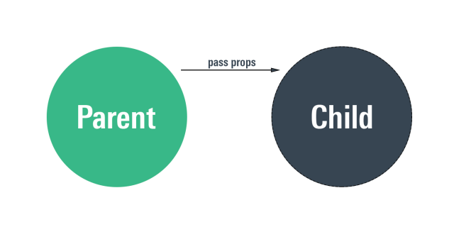
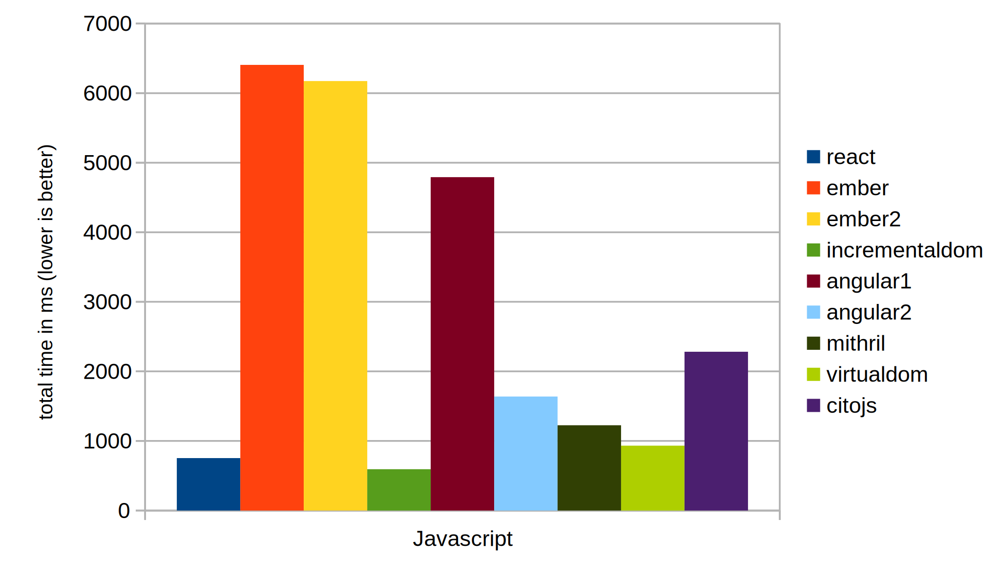

import {
  Head,
  Code,
  Appear,
  components as Components,
} from 'mdx-deck'
import {
  FullscreenCode,
  Split,
  SplitRight,
} from 'mdx-deck/layouts'

import ImageWithLabel from './components/image-with-label'

import ExampleButton from './src/button'
import SimpleUsersPage from './src/users-page-simple.js'

export { default as theme } from './theme'

<Head>
  <title>Introduction to React</title>
</Head>

# Introduction to React

12/10/2018

Author: Grzegorz Rozdzialik

---

## Agenda

1. Brief history of frontend
2. Basics & key concepts of React
3. How to start developing?

---

## Brief history of frontend

### From jQuery to React

---

2006 - first version of jQuery

<ImageWithLabel label="Popularity: jQuery vs Javascript">
  
</ImageWithLabel>

---

<div style={{ background: 'white', padding: 5 }}>
  
</div>

<Appear>
  <div>
  <Components.h3>Pros</Components.h3>

  <Components.ol>
    <Components.li>Solves browser incompatibility problems</Components.li>
    <Components.li>Many out-of-the-box UI components</Components.li>
  </Components.ol>
  </div>
  <div>
  <Components.h3>Cons</Components.h3>
    
  <Components.ol>
    <Components.li>Hard to maintain large codebases</Components.li>
    <Components.li>Useful for small components, not big apps</Components.li>
    <Components.li>Using global state / storing state in DOM</Components.li>
  </Components.ol>
  </div>
</Appear>

---

## Solution?

## JS Frameworks

e.g. AngularJS


(aka Angular 1.x)

---

AngularJS vs jQuery

<ImageWithLabel label="Popularity: AngularJS vs jQuery">
  
</ImageWithLabel>

---

## AngularJS


<Appear>
  <div>
  <Components.h3>Pros</Components.h3>

  <Components.ol>
    <Components.li><strong>Components</strong> storing state & logic</Components.li>
    <Components.li>Many out-of-the-box UI components</Components.li>
    <Components.li><strong>Dependency Injection</strong> and <strong>Services</strong></Components.li>
  </Components.ol>
  </div>
  <div>
  <Components.h3>Cons</Components.h3>
    
  <Components.ol>
    <Components.li>2-way data binding - confusing</Components.li>
    <Components.li>Reduced performance</Components.li>
  </Components.ol>
  </div>
</Appear>

---

## Solution?

## React


<Components.ul>
  <Appear>
    <Components.li>minimal</Components.li>
    <Components.li>performant</Components.li>
    <Components.li>component-oriented</Components.li>
  </Appear>
</Components.ul>

---

## _Basics_ & _key concepts_ of React


---

### Components

- UI composed of components
- JSX - HTML on steroids

```js
function SimpleComponent() {
  return <div>Content</div>
}
```

---

export default SplitRight

### Passing data from parent to children

```js
function UsersPage() {
  return (
    <div>
      <h1>Users</h1>

      <User name="John" age={12} />
      <User name="Alice" age={42} />
    </div>
  )
}

function User(props) {
  return (
    <div>
      <div>Name: {props.name}</div>
      <div>Age: {props.age}</div>
    </div>
  )
}
```

---

## Result

<div
  style={{
    textAlign: 'left',
    background: 'white',
    color: 'black',
  }}
>
  <SimpleUsersPage />
</div>

---

### Props



---

export default SplitRight

```js
function User(props) {
  return (
    <div>
      <div>Name: {props.name}</div>

      <button onClick={props.onClick}>
        Click a button
      </button>
    </div>
  )
}
```

### Child -> parent communication

```js
function Users() {
  const onUserClick = () => {
    console.log('User has been clicked')
  }

  return (
    <div>
      <h1>Users</h1>

      {/* pass an **onClick** callback */}
      <User name="John" onClick={onUserClick} />
      <User name="Alice" onClick={onUserClick} />
    </div>
  )
}
```

---

## Where to store the state?

---

### Functional vs class components

```js
// **Stateless functional** component
function FunctionalComponent(props) {
  return <div>A am functional</div>
}

// **Class** component
class ClassComponent extends React.Component {
  render() {
    return <div>A am a class component</div>
  }
}
```

---

export default Split

```js
class Button extends React.Component {
  state = {
    hasBeenClicked: false,
  }

  render() {
    const { hasBeenClicked } = this.state

    return (
      <button
        onClick={this._onButtonClicked}
        disabled={hasBeenClicked}
      >
        Click me
      </button>
    )
  }
```

### State in class components

```js
  _onButtonClicked = () => {
    this.setState({
      hasBeenClicked: true
    })
  }
}
```

---

<ExampleButton />

---

export default SplitRight

```js
class MyInput extends React.Component {
  state = {
    value: '',
  }

  render() {
    return (
      <input
        value={this.state.value}
        onChange={this.handleChange}
      />
    )
  }

  _handleChange = (event) => {
    this.setState({
      value: event.target.value,
    })
  }
}
```

## One-way data flow

- state is updated explicitly
- no _dirty_ checking (as in AngularJS)

---

export default SplitRight

<ImageWithLabel label="Javascript frameworks performance (time in ms)">
  
</ImageWithLabel>

## Performance

- Virtual DOM
- one-way data flow

---

## Ecosystem of libraries

State management, animations, consuming APIs,

UI libraries, styling (CSS-in-JS)

- `redux`
- `MobX`
- `react-spring`
- `apollo`
- `antd`
- `styled-components`

---

export default SplitRight

```js
<ul>
  {array.map((element) => (
    <li key={element.id}>{element.value}</li>
  ))}
</ul>

<div>
  {shouldRenderChild && <Child />}
</div>
```

## No new templating language to learn

JSX is just Javascript

---

## How do I start developing?

---

1. Install Node
2. Use `create-react-app`

[https://github.com/facebook/create-react-app]()

---


---

## Frontend workshops

### Jak żyć na froncie?


---

## Questions

---

Thank you for your participation.
