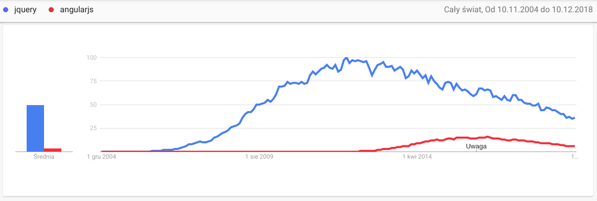

import { Head, Code, Appear, components as Components } from 'mdx-deck'
import { FullscreenCode, Split, SplitRight } from 'mdx-deck/layouts'

import ImageWithLabel from './components/image-with-label'

export { default as theme } from './theme'

<Head>
  <title>Introduction to React</title>
</Head>

# Introduction to React

12/10/2018

Author: Grzegorz Rozdzialik

---

## Agenda

1. History - from jQuery to React
2. Basics of React
3. Key featues
4. How to start developing?

---

## History

### From jQuery to React

---

2006 - first version of jQuery

<ImageWithLabel label="Popularity: jQuery vs Javascript">
  
</ImageWithLabel>

---

## jQuery

<Appear>
  

  <Components.h3>Pros</Components.h3>

  <Components.ol>
    <Components.li>Solves browser incompatibility problems</Components.li>
    <Components.li>Many out-of-the-box UI components</Components.li>
  </Components.ol>
  

  

  <Components.h3>Cons</Components.h3>
    
  <Components.ol>
    <Components.li>Hard to maintain large codebases</Components.li>
    <Components.li>Useful for small components, not big apps</Components.li>
    <Components.li>Using global state / storing state in DOM</Components.li>
  </Components.ol>
  

</Appear>

---

## Solution?

## JS Frameworks

e.g. AngularJS

(aka Angular 1.x)

---

AngularJS vs jQuery

<ImageWithLabel label="Popularity: AngularJS vs jQuery">
  
</ImageWithLabel>

---

## AngularJS

<Appear>
  

  <Components.h3>Pros</Components.h3>

  <Components.ol>
    <Components.li><strong>Components</strong> storing state & logic</Components.li>
    <Components.li>Many out-of-the-box UI components</Components.li>
    <Components.li><strong>Dependency Injection</strong> and <strong>Services</strong></Components.li>
  </Components.ol>
  

  

  <Components.h3>Cons</Components.h3>
    
  <Components.ol>
    <Components.li>2-way data binding - confusing</Components.li>
    <Components.li>Reduced performance</Components.li>
  </Components.ol>
  

</Appear>

---

## Questions

---

Thank you for your participation.
